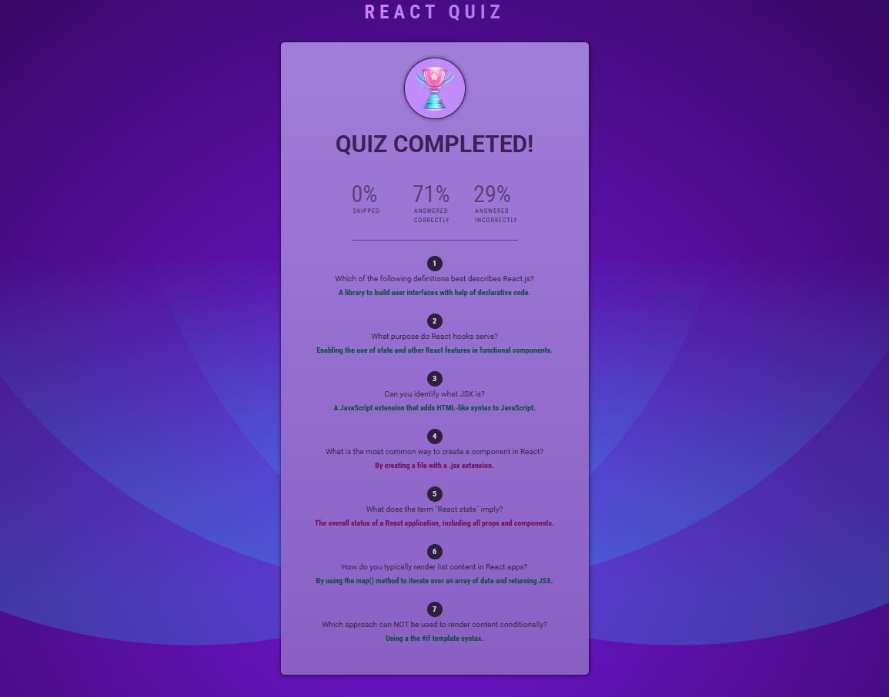
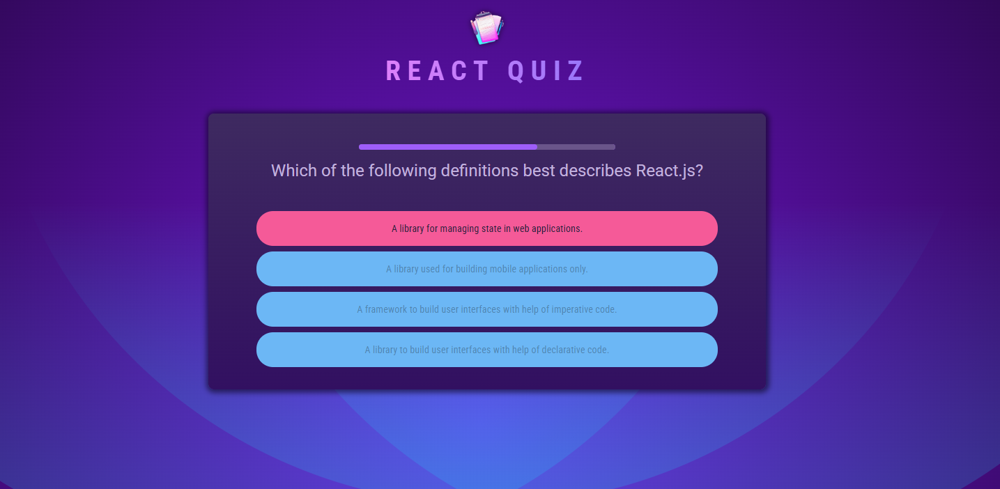
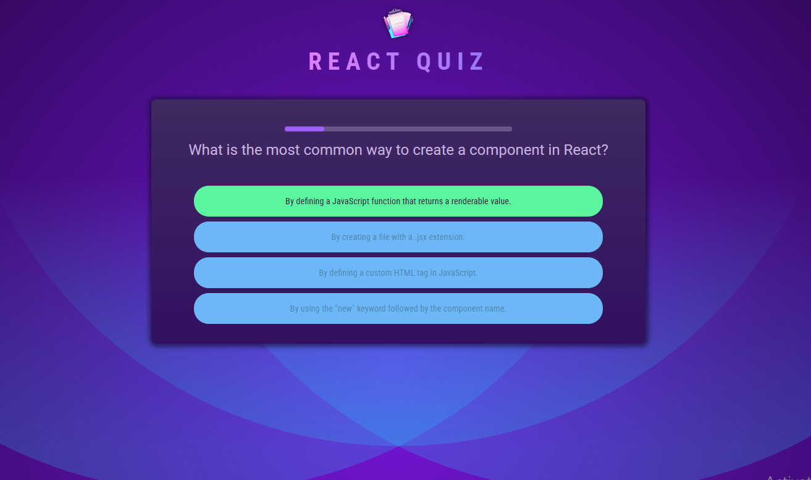
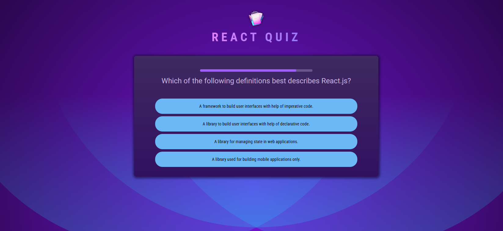

# React Quiz App

A quiz application built with **React**. Users can answer questions, receive immediate feedback, and view a summary of their results at the end of the quiz.

## Features

* Multiple-choice quiz questions
* Randomized answer order
* Countdown timer for each question
* Automatic skipping when the timer expires
* Answer selection and feedback
* Correct and incorrect answer states
* Quiz completion summary
* Percentage breakdown of:

  * Skipped answers
  * Correct answers
  * Incorrect answers
* Detailed review of all answers

## Technologies

* React
* JavaScript
* Vite
* React Hooks
* useState
* useCallback
* useEffect
* useRef

## Screenshots

### Summary

### Wrong Answer

### Correct Answer

### Question Not Answered

